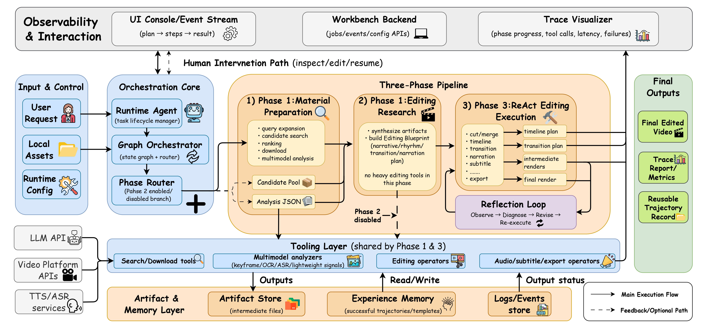

# Crayotter

<p align="center">
  <a href="./README.md">English</a> | <a href="./README_CN.md">中文</a>
</p>

<p align="center">
  
</p>

<p align="center">
  <a href="https://idwts.github.io/Crayotter" target="_blank" rel="noopener noreferrer">
    
  </a>
  <a href="https://github.com/idwts/Crayotter/stargazers" target="_blank" rel="noopener noreferrer">
    
  </a>
  <a href="https://idwts.github.io/Crayotter/paper/" target="_blank" rel="noopener noreferrer">
    
  </a>
</p>

<p align="center">
  如果这个项目能切实帮助到您，欢迎在 GitHub 上给 Crayotter 点一个 Star。
</p>

Crayotter 是一个多模态、Agent 驱动的视频自动编辑系统，可以把一条文本需求转化为完整成片。

Crayotter 工作流由 **规划（planning）**、**深度剪辑研究（deep editing research）** 和 **工具执行（tool-based execution）** 三阶段组成，同时支持基于完整日志与可视化轨迹的调试与迭代功能。

---

## 近期动态

- 2026.5.11：论文页面已上线，见 [Crayotter Paper Page](https://idwts.github.io/Crayotter/paper/)。
- 2026.4.10：优化后的 release 版本已更新。
- 2026.3.30：第一款 release 版本已发布，见[v0.1.0-demo](https://github.com/idwts/Crayotter/releases/tag/v0.1.0-demo)。

---

## 项目概览



本仓库主要由四个核心组件构成：

- **`script\agent.py`**：主入口。负责初始化运行环境、执行任务（根据启动方式不同分交互式或单次请求）、清理工作目录，并写入日志与经验记忆。
- **`script\graph.py`**：编排层（Orchestration Layer，implemented by LangGraph StateGraph）。定义三阶段工作流与状态路由。
- **`script\tools\`**：模块化工具集，覆盖 1.素材的搜索、下载和分析 和 2.基于素材集的剪辑、转场、配音 以及 3.最终成品的字幕与导出。
- **`script\visualize.py`**：基于日志解析的本地可视化服务，用于查看阶段进度和工具调用轨迹。

配套目录：

- **`temp\`**：存储执行过程中的中间文件（如搜索并下载的素材文件）与输出最终剪辑成品文件。
- **`user_temp\`**：存储用户提供的本地素材。
- **`logs\`**：存储运行日志（`video_agent_*.log`）。
- **`memory_experience\`**：存储单次任务后沉淀的历史案例参考文档，仅供方法参考，不能覆盖当前任务目标。
- **`website\`**：静态官网与 GitHub Pages 资源。

---

## 工作流

Crayotter 工作流分三阶段：

1. **Phase 1 — 素材准备（Planner + Executor）**
   - 搜索候选素材
   - 对候选素材进行排序并筛选高质量素材
   - 下载入选视频
   - 对每个源视频执行多模态分析

2. **Phase 2 — 剪辑研究（Editing Research）**
   - 对入选素材读取并分析结果
   - 根据入选素材的分析结果生成结构化剪辑蓝图（叙事、节奏、转场、配音策略）
   - 本阶段不调用剪辑工具

   温馨提示：该阶段可通过运行根目录 `.env` 中的 `CRAYOTTER_ENABLE_PHASE2_RESEARCH=false` 关闭，以节省 token。
   关闭后流程变为：Phase 1 → Phase 3。但剪辑效果可能会有偏差。

3. **Phase 3 — ReAct 自动执行（ReAct Editing Execution）**
   - 对素材执行裁剪、合并、转场、配音/字幕、最终导出
   - 记录完整的工具调用轨迹，用于后续的可视化复盘

---

## 快速开始
### 0）剪辑工具
确保系统的 `PATH` 环境变量中已包含 `ffmpeg` 二进制可执行文件，使其能够在终端中被直接调用。  
可前往 `https://ffmpeg.org/download.html` 下载对应平台的安装包。安装完成后，可在终端执行 `ffmpeg -version`，若能正常输出版本信息，则说明配置成功。

### 1）环境准备

建议 Python 3.10+。

```bash
python -m venv .venv
.venv\Scripts\activate
```

### 2）安装依赖

```bash
pip install -r requirements.txt
```

### 3）API 配置与运行参数设置
#### 第一步：生成配置文件
首先把模板配置文件复制一份，生成专属的自定义配置文件 `.env`，直接在终端执行这条命令即可：
```bash
copy .env.example .env
```

#### 第二步：填写核心配置
打开刚生成的 `.env` 文件，填写/修改以下常用配置，每一项都标注了用途，新手直接按说明填就行：
```env
# 【必填】你的阿里云通义千问API密钥
CRAYOTTER_API_KEY=your-key

# API接口地址（默认已配置好，无需修改）
CRAYOTTER_BASE_URL=https://dashscope.aliyuncs.com/compatible-mode/v1

# 文本对话模型（默认qwen-plus，可按需更换）
CRAYOTTER_MODEL_NAME=qwen-plus

# 视频/多模态理解模型（默认qwen-vl-max-latest）
CRAYOTTER_VIDEO_MODEL_NAME=qwen-vl-max-latest

# 语音合成模型（默认qwen-tts-latest）
CRAYOTTER_TTS_MODEL_NAME=qwen-tts-latest

# 是否开启第二阶段调研（true=开启，false=关闭）
CRAYOTTER_ENABLE_PHASE2_RESEARCH=true

# 是否直接执行第三阶段（true=直接跳过前序步骤，false=按正常流程执行）
CRAYOTTER_DIRECT_PHASE3_EXECUTION=false

# 是否优先使用本地素材（true=优先本地，false=优先在线获取）
CRAYOTTER_PREFER_LOCAL_MATERIALS=false

# 智能代理超时等待时间（单位：秒，默认150秒，超时会自动结束当前任务）
CRAYOTTER_AGENT_STALL_TIMEOUT_SECONDS=150
```

说明：

- `CRAYOTTER_DIRECT_PHASE3_EXECUTION=true`：跳过 Phase 2 素材搜索/下载，直接走“现有素材分析 + Phase 3 执行”链路。
- `CRAYOTTER_PREFER_LOCAL_MATERIALS=true`：先分析本地素材，若当前素材已足够则直接进入后续剪辑，不足时才联网补充。
- `CRAYOTTER_AGENT_STALL_TIMEOUT_SECONDS`：控制任务“长时间无新进展”判定阈值。
- 环境隐式逻辑：图形化工作台中的 API 设置、Phase 2、直达 Phase 3、本地素材优先和超时设置，都会同步写回同一份 `.env`。
- 成品画幅控制：候选素材排序现在会把目标横竖屏当成评分因子：默认优先横屏；如果用户明确要求竖屏，则优先竖屏。Phase 3 合并/导出也改成“放缩后居中裁切”，不再简单拉伸。
- 隐式删除逻辑：对于 `user_temp` 里的用户视频，Crayotter 现在会把对应的 `*_analysis.json` 直接写回 `user_temp`，后续运行自动复用；如果你在 Web 工作台删除这个上传视频，也会一起删除同名分析文件。
- 历史经验压缩：`memory_experience\latest_skills.md` 会被自动压缩成“历史案例参考”，长度受控，*不会随着任务累积而无限变长*，也不会重新定义后续任务目标。

> 安全提醒：不要把真实 API Key 提交到版本控制。

### 4）运行 Agent

交互模式：

```bash
python script\agent.py
```

或单任务模式：

```bash
# 在此处填入你需要制作的成品需求，此处为示例
python script\agent.py "制作一个1分钟校园主题宣传片"
```

### 5）运行图形化工作台

图形化工作台提供了一个直观的 Web 界面，用于管理任务、配置环境以及监控 Agent 的实时状态。

1. 启动本地后端服务：

```bash
# 在本地8765端口打开WEB工作台
python script\run_backend.py --host 127.0.0.1 --port 8765
```

2. 在浏览器打开：

如果在第一步使用 8765 端口：
```text
http://127.0.0.1:8765/ui/
```

3. 工作台当前功能：

- 任务创建：支持创建 `demo` 和 `agent` 任务
- 环境配置：与 `.env` 双向同步的本地配置管理
- 历史任务查看
- 结构化日志与事件查看
- 产物预览与打开

后端同时暴露这些本地接口：

- `GET /health`
- `GET /config`
- `PUT /config`
- `GET /jobs`
- `POST /jobs`
- `GET /jobs/{job_id}`
- `GET /jobs/{job_id}/events`
- `POST /jobs/{job_id}/cancel`

> 图形化工作台以运行根目录 `.env` 作为唯一配置真源。不要提交真实 `.env`。

---

## 日志轨迹可视化

1. 直接使用最新日志启动可视化：

```bash
python script\visualize.py
```

2. 或对指定日志文件启动可视化：

```bash
python script\visualize.py logs\<video_agent_YYYYMMDD_HHMMSS>.log
```
请将 `<video_agent_YYYYMMDD_HHMMSS>.log`文件名替换为您在 `logs` 目录下实际生成的日志名称

3. 网络配置：可视化界面默认运行在 8080 端口。如果该端口被占用或有特定需求，可使用 `--port` 参数自定义：

```bash
# 将 Web 端口设置为 9000
python script/visualize.py --port 9000
```

4. 隐式导出静态HTML：`script\visualize.py` 还会在日志同目录导出静态 HTML 轨迹文件（例如 `*_trace.html`）。

---

## 仓库结构

```text
Crayotter\
├─ script\
│  ├─ agent.py
│  ├─ graph.py
│  ├─ visualize.py
│  └─ tools\
├─ logs\
├─ temp\
├─ user_temp\
├─ memory_experience\
├─ website\
├─ logo.png
└─ requirements.txt
```
